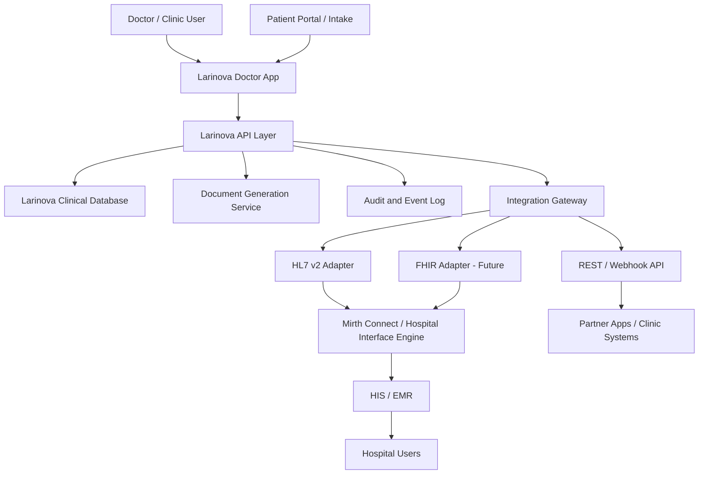

# Larinova Hospital Integration Readiness

**Date:** 2026-05-05  
**Prepared for:** Gabriel Antony Xaviour / Balachandar Seeman  
**Purpose:** Convert the example integration approach shared by Seeman Sir into a Larinova-ready architecture discussion for hospital IT, product evaluation, and future integration planning.

## Executive Summary

Larinova is currently strongest as an OPD workflow product: patient records, consultations, AI-assisted clinical documentation, prescriptions/documents, and follow-up workflows. For hospital integration, the immediate credible posture is not "HL7 integration is already shipped"; it is:

1. Larinova has the clinical workflow layer that hospitals and clinics can evaluate now.
2. Larinova can expose or consume integration events through a phased interface layer.
3. The example Isansys document shows the kind of technical clarity hospital IT teams expect: HL7 v2.6 messages for clinical observations, Mirth Connect as interoperability middleware, acknowledgement handling, and optional real-time streaming for high-frequency signals.

The fastest next step is to present Larinova as "integration-ready by design" with a clear interface roadmap rather than over-claiming a completed HIS/EMR connector.

## Reference Document Takeaways

Source example file: `/Users/gabrielantonyxaviour/Downloads/Hospital Integration Technical Approach V1.7.pdf`

This PDF is treated only as an example/reference format shared by Seeman Sir. It is not Larinova's current implementation, not a vendor dependency decision, and not something Larinova should claim as already built.

The example document describes a healthcare integration model with:

- A central clinical server that aggregates bedside/patient data.
- A database and web services layer that exposes stored data.
- An interoperability module using Mirth Connect.
- HL7 v2.6 ORU-style data pushes for patient observations.
- Required message segments such as MSH, PID, and OBX.
- Optional acknowledgement messages from the receiving EMR/HIS.
- An on-demand ECG workflow triggered by web service call and streamed to an MQTT server.

For Larinova, the same pattern translates into a broader clinical workflow exchange:

- Patient identity and demographics.
- Appointment and consultation lifecycle events.
- Clinical notes, prescriptions, certificates, summaries, and attachments.
- Future vitals/observations, if Larinova integrates devices or hospital feeds.
- Audit trail for document creation, doctor review, signature, and share events.

## Current Larinova Product Surface

Current relevant implementation areas:

- Doctor app: `app/`
- Documents API: `app/app/api/documents/route.ts`
- Structured sick-leave certificate form: `app/components/documents/SickLeaveCertificateDialog.tsx`
- Certificate content builder: `app/lib/documents/sick-leave-certificate.ts`
- App database/project identity: `afitpprgfsidrnrrhvzs`, documented in `docs/ENVIRONMENT.md`

Current product strengths:

- Patient-first document creation flow exists for sick-leave medical certificates.
- Certificate generation is tied to an authenticated doctor workflow, not an anonymous fake-certificate generator.
- Patient demographics can be reused from the patient record.
- Doctor identity, license number, and clinic address can be included in document output.
- Document generation already lives inside the OPD workflow, so it can become a natural part of consultation closeout.

Current gaps to be explicit about:

- HL7/Mirth integration is not currently implemented.
- No production HIS/EMR connector is currently proven.
- No live hospital device/vitals integration is currently proven.
- Certificate UX still needs final browser proof on the actual production flow.
- Signature, seal, verification QR/link, and document recipient workflows need to be formalized before broad certificate positioning.

## Proposed Integration Architecture

## Data Flow Options

### Phase 1: Clinic/partner API

Best for fast validation with small clinics and partner tools.

- Create patient.
- Update patient demographics.
- Create appointment/consultation.
- Push generated documents.
- Pull consultation summaries or document status.
- Webhooks for document-created, prescription-created, consultation-completed, and patient-follow-up-due events.

### Phase 2: Hospital interface engine

Best for formal hospital IT evaluation.

- Keep Larinova product as the clinical workflow frontend.
- Add an integration gateway that maps Larinova events to hospital formats.
- Support Mirth Connect as the neutral integration layer where hospitals already use it.
- Start with document/consultation events before attempting full clinical observation streaming.

### Phase 3: HL7/FHIR package

Best after a pilot hospital gives exact interface requirements.

- HL7 v2 messages for admissions/encounters/documents/observations where required.
- FHIR resources where hospital IT prefers modern APIs.
- ACK/error handling and retry queue.
- Integration monitoring dashboard.

## Candidate Interface Scope

| Interface | Direction | Priority | Notes |
|---|---:|---:|---|
| Patient demographics | HIS to Larinova or bidirectional | P0 | Avoid duplicate patient entry in hospital/clinic workflows. |
| Appointment/encounter | HIS to Larinova | P0 | Opens the consult workflow at the right time. |
| Consultation summary | Larinova to HIS | P0 | Main value proof for AI documentation. |
| Prescription | Larinova to HIS | P0 | Should include medication details, doctor identity, and timestamp. |
| Medical certificate | Larinova to HIS / recipient | P0 | Needs verification and doctor-signature controls. |
| Transcript/SOAP note | Larinova to HIS | P1 | Depending on hospital policy and data retention. |
| Vitals/observations | HIS/device to Larinova or Larinova to HIS | P1 | Only after deciding device and monitoring scope. |
| Real-time waveforms | Device/HIS path | P3 | Not near-term unless a hospital specifically requires it. |

## Readiness Checklist

### Product

- [x] Patient-linked certificate creation flow exists for sick-leave certificates.
- [x] Certificate output includes patient, doctor, issue date, condition, treatment, and leave window.
- [ ] Add certificate type library beyond sick leave.
- [ ] Add verification link or QR.
- [ ] Add doctor signature/seal workflow.
- [ ] Add document recipient/share audit.
- [ ] Browser-test document creation, preview, print/download, and mobile layout.

### Technical

- [x] Supabase-backed app database exists.
- [x] Server API route validates structured certificate inputs.
- [ ] Define canonical Larinova clinical event schema.
- [ ] Add API auth model for external clinic/hospital systems.
- [ ] Add outbound webhooks.
- [ ] Add retryable integration event queue.
- [ ] Prototype HL7/FHIR mapping only after pilot requirements are confirmed.

### Hospital IT Discussion

- [ ] Ask whether their HIS/EMR supports REST, HL7 v2, FHIR, or Mirth.
- [ ] Ask whether they need one-way export or bidirectional sync.
- [ ] Ask who owns patient master data.
- [ ] Ask whether generated documents need to be stored in HIS, shared by WhatsApp/email, or both.
- [ ] Ask whether they require on-prem deployment, VPN, IP allowlist, or cloud API access.
- [ ] Ask data retention, consent, audit, and doctor-signature rules.

## Open Questions for Seeman Sir / Hospital Evaluators

1. Is the expected first integration with a clinic EMR, hospital HIS, or a standalone partner app?
2. Which system owns patient identity: Larinova, hospital HIS, or both?
3. Is HL7 required immediately, or is a secure REST/webhook pilot acceptable?
4. Are certificates expected to be signed digitally, physically stamped, or doctor-reviewed and downloaded?
5. Should certificates be delivered only to the patient, to the requesting employer/institution, or also back to the hospital record?
6. Does the hospital expect document output only, or full appointment/patient/consultation synchronization?

## Recommended Today Positioning

Use this wording in follow-up:

> Larinova's current product flow already supports patient-linked medical documentation inside the doctor workflow. The integration reference helped us frame the next layer: a secure integration gateway that can begin with REST/webhooks for pilot clinics and then map into HL7/Mirth or FHIR for formal hospital environments. We should not claim HL7 is already live, but we can show the architecture, data objects, and phased path clearly.
