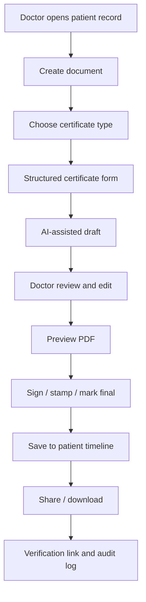

# Medical Certificate Market Reference

**Date:** 2026-05-05  
**Purpose:** Summarize the reference products shared by Balachandar Seeman and convert them into Larinova product implications.

## Source Links

- `https://medicalcertificategenerator.co/`
- `https://www.medbond.in/get-medical-certificate-in-bangalore`
- `https://www.medbond.in/sample`
- `https://medicalcertificate.in/`

## Market Pattern

The market separates into two lanes:

1. **Template/generator lane:** fast forms, live preview, PDF/image export, and low friction. This lane is useful as a UX benchmark but has reputational risk if it looks like fake-certificate tooling.
2. **Doctor-issued service lane:** user submits request, doctor reviews/consults, certificate is delivered digitally, sometimes with physical copy or handwritten format. This lane is closer to where Larinova should position because Larinova already serves authenticated doctors.

Larinova should not become an anonymous certificate generator. The stronger product angle is:

> A verified doctor workflow for generating, reviewing, signing, sharing, and auditing medical certificates from the existing patient record.

## Competitor/Reference Summary

| Reference | What it shows | Useful takeaway for Larinova | Risk to avoid |
|---|---|---|---|
| MedicalCertificateGenerator.co | Free generator, multiple templates, live preview, PDF/image download, local-device privacy messaging. | Doctors expect speed, structured fields, preview before download, and reusable templates. | Avoid fake-certificate framing and anonymous generation. |
| MedBond Bangalore page | Service packaging around medical certificates, fitness certificates, sick leave, Form 1A, doctor consultation, samples, payment/trust support. | Packaging and certificate-type breadth matter as much as document generation. | Do not claim acceptance/compliance without evidence. |
| MedBond sample page | Many certificate categories: sick leave, WFH, fitness, diagnosis, caretaker, recovery, Form 1A, sports, prescription, handwritten, eye, CARA, unfit to travel. | Larinova can create a certificate library inside the doctor document module. | Avoid adding too many low-quality templates before the core doctor flow is verified. |
| MedicalCertificate.in | Doctor review, questionnaire, consultation, WhatsApp delivery, physical copy option, NMC/WHO guideline claims, ABHA/ABDM positioning. | Verification, doctor identity, speed of delivery, and ABDM/health identity signals are value drivers. | Do not present Larinova as a direct-to-patient certificate shop unless licensed operations are in place. |

## Certificate Types to Prioritize

### P0: Add first

- Sick leave certificate
- Medical fitness certificate
- Recovery / return-to-work certificate
- Work-from-home medical certificate
- Medical diagnosis certificate
- Caretaker certificate

These are broadly useful for OPD doctors and fit the current patient-document workflow.

### P1: Add after verification/signature workflow

- Form 1A driving license fitness certificate
- Fit-to-fly / unfit-to-travel certificate
- Sports fitness certificate
- College/school leave certificate
- Prescription-linked certificate

These may require special formatting, specialty constraints, or extra verification.

### P2: Add only with clear doctor/legal review

- CARA adoption fitness certificate
- International country-specific certificates
- Government/RTO-specific variants
- Handwritten-style certificate output

These need stronger compliance review and should not be rushed into the product as generic templates.

## Product Requirements for Larinova

### Doctor workflow

- Select patient first.
- Choose certificate type.
- Auto-fill patient demographics from record.
- Auto-fill doctor name, registration/license number, specialization, clinic address.
- Ask only certificate-specific fields.
- Generate clinical wording with AI assistance, but keep doctor in control.
- Preview before saving.
- Save to patient record.
- Allow doctor to sign/stamp or mark as draft.
- Download PDF and share through approved channels.
- Audit who created, edited, signed, downloaded, and shared.

### Trust and verification

- Every issued certificate should show doctor identity and registration number.
- Drafts should be visibly marked as drafts until doctor approval/signature.
- Add QR or verification link for recipient validation.
- Keep document tamper-evident: certificate ID, issued timestamp, doctor, patient, and status.
- Keep certificate history attached to the patient.

### Operational positioning

Larinova should position this as a doctor productivity and compliance feature:

> Generate valid medical certificates from the consultation record in under a minute, with patient details, doctor details, verification, and an audit trail.

Avoid positioning that sounds like:

- Fake medical certificate generator.
- Patient self-service certificate creation without doctor review.
- Guaranteed employer/airline/government acceptance.
- AI-issued legal certificate without licensed doctor approval.

## Suggested Larinova Certificate Module

## Immediate Product Backlog

1. Add certificate type selector to the existing medical certificate dialog.
2. Expand the content builder into certificate-specific builders.
3. Add verification metadata to document records.
4. Add draft/final status.
5. Add doctor signature/seal source.
6. Add PDF export polish and recipient verification page.
7. Add browser tests for certificate creation and print/download flow.

## Message to Seeman Sir

> The certificate references are useful because they show both speed and breadth. Our better route is not to copy anonymous certificate generators, but to make Larinova the doctor-side system that issues patient-linked, auditable, verified certificates from the actual OPD workflow. We already have a sick-leave certificate flow started; the next step is expanding the certificate library and adding verification/signature controls.

